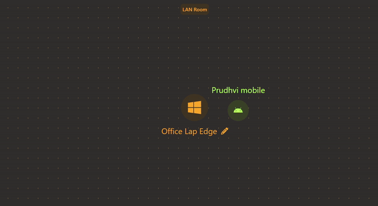

<div align="center"><a name="readme-top"></a>

[![][image-head]][realy-site]

[![][image-seperator]][realy-site]

### Relay : Peer to Peer File Sharing


</div>


**Relay** is a simple web application to transfer files between devices in the same local network using WebRtc. Using WebRtc, we can transfer files in a peer to peer fashion without the need for a server to intermediate the file transfer. 

**WebRtc** requires a signalling mechanism for the peers to discover each other. In this example, I used firebase to implement signalling between the peers, but this can be done with any implementation. 

<bl/>

<div align="center">
  
</div>

## Development Setup

To run this application, you need `bun` installed. Clone the repository and run
```
bun intall 
bun dev
```

For the application to work as is with the firebase signalling, you need to setup a firebase project and provide all the required environment variables. 

**Note:** You can implement your own signalling. This may require a little bit of work as the code is tightly coupled to firebase signalling implementation.

[realy-site]: https://relay-ubs.pages.dev/

[image-seperator]: https://eigent-ai.github.io/.github/assets/seperator.png 
[image-head]: ./assets/Relay.jpg